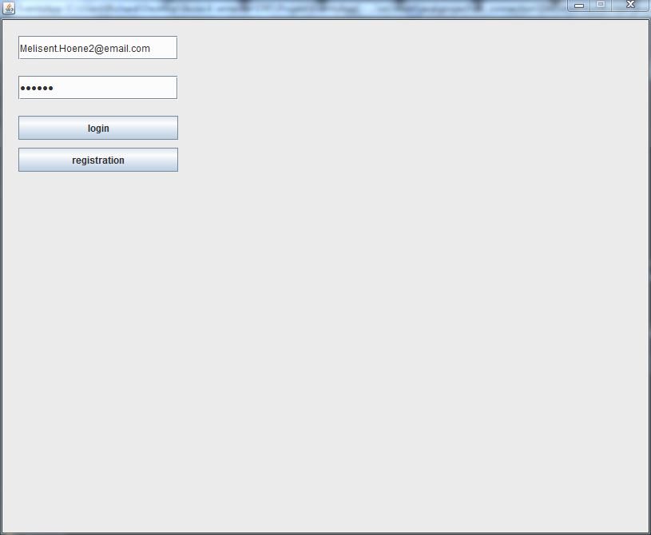
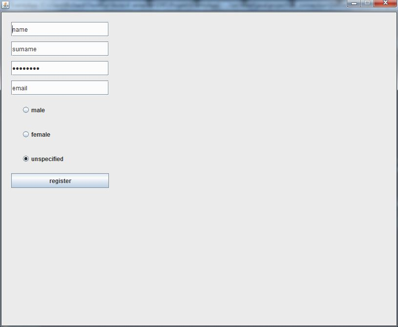
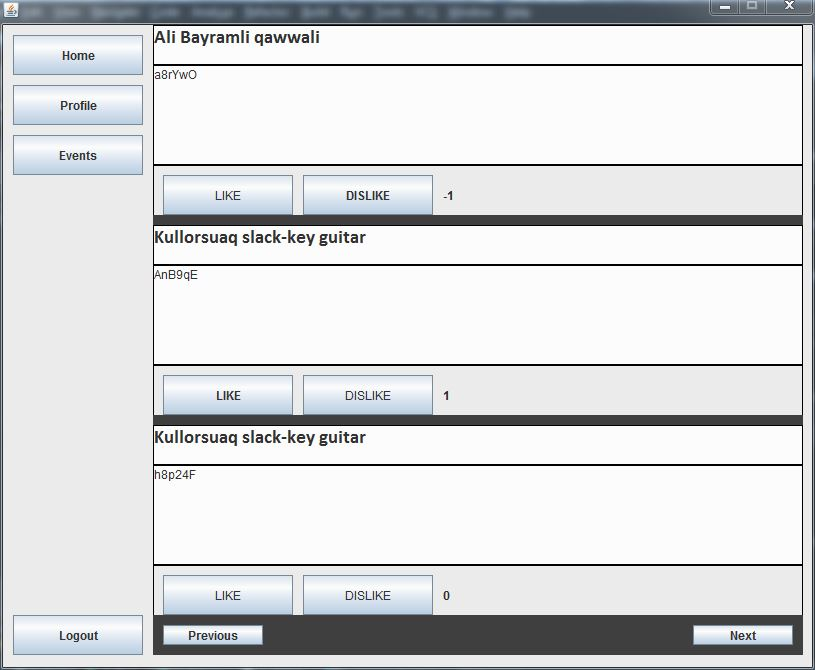
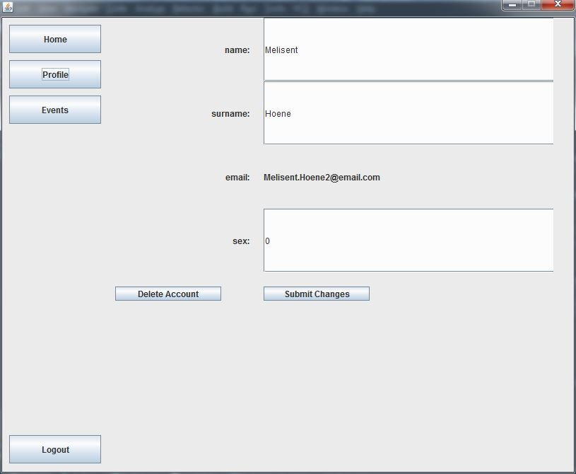
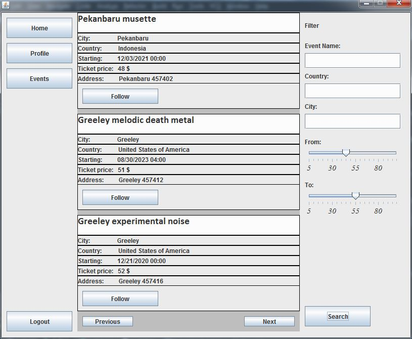

# EventsApp

## Martin Bombala, Richard Bubrín

### Zadanie

Vo vami zvolenom prostredí vytvorte databázovú aplikáciu, ktorá komplexne rieši nižšie definované scenáre vo vami zvolenej doméne. Presný rozsah a konkretizáciu scenárov si dohodnete s Vašim cvičiacim na cvičení. Projekt sa rieši vo dvojiciach, pričom sa očakáva, že na synchronizáciu práce so spolužiakom / spolužiačkou použijete **git**.

### Opis domény

Vytvorili sme aplikáciu Eventsapp, ktorá slúži pre použivateľov, ktorý si vedia v aplikácií vytvoriť svoj vlastný účet a následne sa do nej prihlásiť. Po prihlásení do aplikácie sa používateľom zobrazujú posty eventov, ktoré sledujú. Používateľ môže na jednotlivé posty zadať aký má na nich názor, či už kladný, alebo záporný. Používateľ si môže v aplikácií vyhladať eventy, podľa kritérií, ktoré si sám nastaví a následne môže zvoliť možnosť, aby sledoval príspevky pre dané udalosti. Používateľ má možnosť manipulácie  so svojím vlastným profilom, čo znamená, že si môže svoj profil kedykoľvek upraviť alebo vymazať.

### Popis scenárov

Po spustení aplikácie sa na obrazovke zobrazia dve políčka a dva tlačidlá. Prvé políčko je pre zadanie nicknamu v podobe mailu, a druhé pre password. Po vyplnení vstupných údajov používateľ stlačí tlačidlo Login.

**1.Login**

Tlačidlo Login spustí príkaz ```"SELECT * FROM \"user\" WHERE email LIKE '" + username + "' AND password LIKE '" + password + "'"``` , ktorý zistí či sa v databáze nachádza daný použivateľ s daným heslom. Ak áno obrazovka sa presunie do hlavného okna, inak sa zobrazí oznam o tom, že proces Login neprebehol úspešne.



**2.Registration**

Na obrazovke po spustení aplikácie sa tak isto nachádza tlačidlo Registration. Po stlačení tohto tlačidla sa presunie obrazovka do ďaľšieho okna, kde má používateľ možnosť sa zaregistrovať (vytvoriť nového usera). V tomto okne vyplní pužívaťeľ potrebné údaje sa stlačí tlačidlo Register, ktoré spustí príkaz ```"INSERT INTO public.user (name, surname, password, email, sex) VALUES" + " ('" + name + "', '" + surname + "', '" + password + "', '" + email + "', " + sex + ");"``` , ktorý vloží používateľa do databázy.



**3.Home**

Po úspešnom logine sa zobrazí hlavné okno, v ktorom sa vykresluje na ľavej strane obrazovky navigation bar, ktorý zobrazuje tlačidlá home, profil, events a logout a na pravej strane obrazovky sa zobrazujú posty eventov, ktoré má používateľ lajknuté. Toto zobrazenie postov zabezpečuje príkaz ```"SELECT p.*, e.name, coalesce(sss.opinion, 0) AS opinion, coalesce(sub.like_count, 0) AS like_count FROM \"user\" AS u JOIN event_like AS el ON u.id = el.user_id JOIN event AS e" + " JOIN post AS p On p.event_id = e.id" + " ON e.id = el.event_id" + " LEFT JOIN (SELECT p.opinion, p.post_id FROM \"user\" AS u JOIN posts_like AS p ON u.id = p.user_id WHERE u.id = " + userId + " ) AS sss" + " ON sss.post_id = p.id LEFT JOIN (SELECT p.post_id, SUM(p.opinion) AS like_count FROM posts_like AS p GROUP BY p.post_id) AS sub" + " ON sub.post_id = p.id" + " WHERE u.id = " + userId + " ORDER BY p.id " + "LIMIT 3 OFFSET " + actualPosition*3;``` , ktorý sa stará aj o stránkovanie. Toto hlavné okno sa zobrazí použivateľovi aj po stlačení tlačidla Home.
Na to aby použávateľ mohol prvý krát lajknúť post využívame príkaz ```"INSERT INTO posts_like (user_id, post_id, opinion) VALUES" + "  (" + getUserId() + "," + postId + "," + opinion + ");"``` . Ak už pužívateľ má na post zadaný opinion a chce ho zmeniž využíva sa príkaz ```UPDATE posts_like " + "SET opinion = " + opinion + " " + "WHERE user_id = " + getUserId() + " AND " + "post_id = " + postId + ";"```. Na zistenie, či už používateľ lajkol nejaký post využívame príkaz ```"SELECT * FROM posts_like WHERE user_id = " + getUserId() + " AND post_id = " + postId + ";"```



**4.Profil**

Po stlačení tlačidlá Profile sa používateľovi zobrazí okno, v ktorom je možné meniť použivateľské údaje. Najprv sa mu ukážú pôvodné osobné údaje. Tieto údaje môže zmeniť a zmenu zaznamená tlačidlom Submit, ktoré spúšťa príkaz ```"UPDATE \"user\" " + "SET name = '"+name+"', " + "    surname = '"+surname+"', " + "    sex = "+sex+" " + "WHERE id = "+Data.getInstance().getUser().getId()+";"``` . V okne, ktoré sa zobrazí po stlačení tlačidla Profile, je tak isto ďaľšie tlačidlo Delete, ktoré zabezpečuje vymazanie používateľa z databázy prostredníctvom príkazu ```"DELETE FROM \"user\" " + "WHERE id = "+Data.getInstance().getUser().getId()+";"```



**5.Event**

Po stlačení tlačidla Events, sa používateľovi zobrazí okno, v ktorom si môže vyfiltrovať a zobraziť eventy podľa svojich predstáv. Eventu sa filtrujú pomocou príkazu

		queryBuilder = new StringBuilder("SELECT * FROM event WHERE ");
        if(name != null && !name.isEmpty()) {
            queryBuilder.append("lower(name) LIKE LOWER('").append(name).append("%') AND ");
        }

        if(country != null && !country.isEmpty()) {
            queryBuilder.append("lower(country) LIKE lower('").append(country).append("%') AND ");
        }

        if(city != null && !city.isEmpty()) {
            queryBuilder.append("lower(city) LIKE LOWER('").append(city).append("%') AND ");
        }

        queryBuilder.append("ticket_price < ").append(to).append(" AND ticket_price > ").append(from);

        queryBuilder.append(" LIMIT 3 OFFSET ").append(actualPosition*3);

Používateľ má možnosť začať sledovať posty vyhladaného eventu prostredníctvom príkazu ```"INSERT INTO event_like (user_id, event_id, opinion) VALUES ("+Data.getInstance().getUser().getId()+","+id+",1);"```



### Data Model


#### event
Tabuľka event obsahuje jednotlivé eventy
#### event_like
Tabuľka event_like je väzobná tabuľka, pre zaznamenávanie, ktoré eventy lajkli jednotliví použivatelia
#### post
Tabuľka post obsahuje jednotlivé posty
#### post_like
Tabuľka post_like je väzobná tabuľka, pre zaznamenávanie, ktoré posty lajkli jednotliví použivatelia
#### user
Tabuľka user obsahuje jednotlivých userov
#### artist
Tabuľka artist obsahuje jednotlivých umelcov
#### artist_like
Tabuľka artist_like je väzobná tabuľka, pre zaznamenávanie, ktorých umelcov lajkli jednotliví použivatelia
#### concert
Tabuľka concert obsahuje jednotlivé koncerty
#### style
Tabuľka concert obsahuje jednotlivé štýly
#### artist_style
Tabuľka artist_style je väzobná tabuľka, pre zaznamenávanie, aké štýly preferujú jednotliví umelci
#### ticket
Tabuľka concert obsahuje jednotlivé lístky

### Optimalizácia

Aby aplikácia prebiehala v čo najoptimálnejšom čase aj keď tabuľky obsahujú obrovské množstvo dát, sme vytvorili indexy pre vyhľadávanie dát v tabuľke:

	CREATE INDEX login_index ON "user" (email, PASSWORD)
	CREATE INDEX event_filter_index ON event (LOWER(NAME) VARCHAR_PATTERN_OPS, LOWER(country) VARCHAR_PATTERN_OPS, LOWER(city) VARCHAR_PATTERN_OPS, ticket_price)
	CREATE INDEX event_filter_index_ticket ON event (ticket_price);
	CREATE INDEX event_filter_index_name_ticket ON event (LOWER(NAME) VARCHAR_PATTERN_OPS, ticket_price);
	CREATE INDEX event_filter_index_country_ticket ON event (LOWER(country) VARCHAR_PATTERN_OPS, ticket_price);
	CREATE INDEX event_filter_index_city_ticket ON event (LOWER(city) VARCHAR_PATTERN_OPS, ticket_price);
	CREATE INDEX event_filter_index_name_country_ticket ON event (LOWER(NAME) VARCHAR_PATTERN_OPS, LOWER(country) VARCHAR_PATTERN_OPS, ticket_price);
	CREATE INDEX event_filter_index_name_city_ticket ON event (LOWER(NAME) VARCHAR_PATTERN_OPS, LOWER(city) VARCHAR_PATTERN_OPS, ticket_price);
	CREATE INDEX event_filter_index_country_city_ticket ON event (LOWER(country) VARCHAR_PATTERN_OPS, LOWER(city) VARCHAR_PATTERN_OPS, ticket_price);

### Technická dokumentácia

Program je naprogramovaný v Jave a na spojenie s databázou sme použili jdbc connector, databázu sme riešili cez PostgreSQL. Pre databázové a dátové objekty 'user'-a sme využili návrhový vzor Singleton. Na frontend aplikácie sme použili Java Swing.
