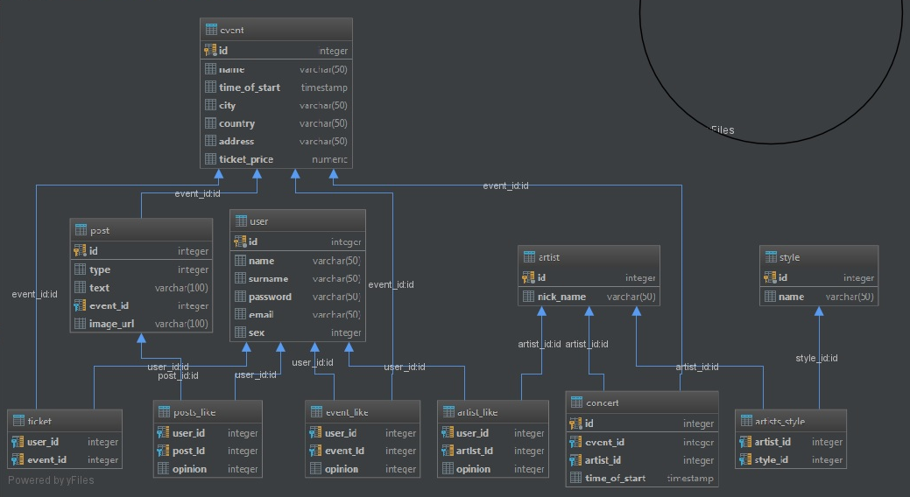

# EventsApp

## Martin Bombala, Richard Bubrín

### Zadanie

Vo vami zvolenom prostredí vytvorte databázovú aplikáciu, ktorá komplexne rieši ni�šie definované scenáre vo vami zvolenej doméne. Presnı rozsah a konkretizáciu scenárov si dohodnete s Vašim cvièiacim na cvièení. Projekt sa rieši vo dvojiciach, prièom sa oèakáva, �e na synchronizáciu práce so spolu�iakom / spolu�iaèkou pou�ijete **git**.

### Opis domény 

Vytvorili sme aplikáciu Eventsapp, ktorá slú�i pre pou�ivate¾ov, ktorı si vedia v aplikácií vytvori� svoj vlastnı úèet a následne sa do nej prihlási�. Po prihlásení do aplikácie sa pou�ívate¾om zobrazujú posty eventov, ktoré sledujú. Pou�ívate¾ mô�e na jednotlivé posty zada� akı má na nich názor, èi u� kladnı, alebo zápornı. Pou�ívate¾ si mô�e v aplikácií vyhlada� eventy, pod¾a kritérií, ktoré si sám nastaví a následne mô�e zvoli� mo�nos�, aby sledoval príspevky pre dané udalosti. Pou�ívate¾ má mo�nos� manipulácie  so svojím vlastnım profilom, èo znamená, �e si mô�e svoj profil kedyko¾vek upravi� alebo vymaza�.

### Popis scenárov

Po spustení aplikácie sa na obrazovke zobrazia dve políèka a dva tlaèidlá. Prvé políèko je pre zadanie nicknamu v podobe mailu, a druhé pre password. Po vyplnení vstupnıch údajov pou�ívate¾ stlaèí tlaèidlo Login. 

**1.Login**

Tlaèidlo Login spustí príkaz ```"SELECT * FROM \"user\" WHERE email LIKE '" + username + "' AND password LIKE '" + password + "'"``` , ktorı zistí èi sa v databáze nachádza danı pou�ivate¾ s danım heslom. Ak áno obrazovka sa presunie do hlavného okna, inak sa zobrazí oznam o tom, �e proces Login neprebehol úspešne.


**2.Registration**

Na obrazovke po spustení aplikácie sa tak isto nachádza tlaèidlo Registration. Po stlaèení tohto tlaèidla sa presunie obrazovka do ïa¾šieho okna, kde má pou�ívate¾ mo�nos� sa zaregistrova� (vytvori� nového usera). V tomto okne vyplní pu�íva�e¾ potrebné údaje sa stlaèí tlaèidlo Register, ktoré spustí príkaz ```"INSERT INTO public.user (name, surname, password, email, sex) VALUES" + " ('" + name + "', '" + surname + "', '" + password + "', '" + email + "', " + sex + ");"``` , ktorı vlo�í pou�ívate¾a do databázy.
	
	
	
**3.Home** 

Po úspešnom logine sa zobrazí hlavné okno, v ktorom sa vykresluje na ¾avej strane obrazovky navigation bar, ktorı zobrazuje tlaèidlá home, profil, events a logout a na pravej strane obrazovky sa zobrazujú posty eventov, ktoré má pou�ívate¾ lajknuté. Toto zobrazenie postov zabezpeèuje príkaz ```"SELECT p.*, e.name, coalesce(sss.opinion, 0) AS opinion, coalesce(sub.like_count, 0) AS like_count FROM \"user\" AS u JOIN event_like AS el ON u.id = el.user_id JOIN event AS e" + " JOIN post AS p On p.event_id = e.id" + " ON e.id = el.event_id" + " LEFT JOIN (SELECT p.opinion, p.post_id FROM \"user\" AS u JOIN posts_like AS p ON u.id = p.user_id WHERE u.id = " + userId + " ) AS sss" + " ON sss.post_id = p.id LEFT JOIN (SELECT p.post_id, SUM(p.opinion) AS like_count FROM posts_like AS p GROUP BY p.post_id) AS sub" + " ON sub.post_id = p.id" + " WHERE u.id = " + userId + " ORDER BY p.id " + "LIMIT 3 OFFSET " + actualPosition*3;``` , ktorı sa stará aj o stránkovanie. Toto hlavné okno sa zobrazí pou�ivate¾ovi aj po stlaèení tlaèidla Home.
Na to aby pou�ávate¾ mohol prvı krát lajknú� post vyu�ívame príkaz ```"INSERT INTO posts_like (user_id, post_id, opinion) VALUES" + "  (" + getUserId() + "," + postId + "," + opinion + ");"``` . Ak u� pu�ívate¾ má na post zadanı opinion a chce ho zmeni� vyu�íva sa príkaz ```UPDATE posts_like " + "SET opinion = " + opinion + " " + "WHERE user_id = " + getUserId() + " AND " + "post_id = " + postId + ";"```. Na zistenie, èi u� pou�ívate¾ lajkol nejakı post vyu�ívame príkaz ```"SELECT * FROM posts_like WHERE user_id = " + getUserId() + " AND post_id = " + postId + ";"```
	
	
	
**4.Profil**

Po stlaèení tlaèidlá Profile sa pou�ívate¾ovi zobrazí okno, v ktorom je mo�né meni� pou�ivate¾ské údaje. Najprv sa mu uká�ú pôvodné osobné údaje. Tieto údaje mô�e zmeni� a zmenu zaznamená tlaèidlom Submit, ktoré spúš�a príkaz ```"UPDATE \"user\" " + "SET name = '"+name+"', " + "    surname = '"+surname+"', " + "    sex = "+sex+" " + "WHERE id = "+Data.getInstance().getUser().getId()+";"``` . V okne, ktoré sa zobrazí po stlaèení tlaèidla Profile, je tak isto ïa¾šie tlaèidlo Delete, ktoré zabezpeèuje vymazanie pou�ívate¾a z databázy prostredníctvom príkazu ```"DELETE FROM \"user\" " + "WHERE id = "+Data.getInstance().getUser().getId()+";"```


**5.Event**

Po stlaèení tlaèidla Events, sa pou�ívate¾ovi zobrazí okno, v ktorom si mô�e vyfiltrova� a zobrazi� eventy pod¾a svojich predstáv. Eventu sa filtrujú pomocou príkazu 
		
		queryBuilder = new StringBuilder("SELECT * FROM event WHERE ");
        if(name != null && !name.isEmpty()) {
            queryBuilder.append("lower(name) LIKE LOWER('").append(name).append("%') AND ");
        }
 
        if(country != null && !country.isEmpty()) {
            queryBuilder.append("lower(country) LIKE lower('").append(country).append("%') AND ");
        }
 
        if(city != null && !city.isEmpty()) {
            queryBuilder.append("lower(city) LIKE LOWER('").append(city).append("%') AND ");
        }
 
        queryBuilder.append("ticket_price < ").append(to).append(" AND ticket_price > ").append(from);
 
        queryBuilder.append(" LIMIT 3 OFFSET ").append(actualPosition*3);

Pou�ívate¾ má mo�nos� zaèa� sledova� posty vyhladaného eventu prostredníctvom príkazu ```"INSERT INTO event_like (user_id, event_id, opinion) VALUES ("+Data.getInstance().getUser().getId()+","+id+",1);"```


### Data Model
	


#### event
Tabu¾ka event obsahuje jednotlivé eventy
#### event_like
Tabu¾ka event_like je väzobná tabu¾ka, pre zaznamenávanie, ktoré eventy lajkli jednotliví pou�ivatelia
#### post
Tabu¾ka post obsahuje jednotlivé posty
#### post_like
Tabu¾ka post_like je väzobná tabu¾ka, pre zaznamenávanie, ktoré posty lajkli jednotliví pou�ivatelia
#### user
Tabu¾ka user obsahuje jednotlivıch userov
#### artist
Tabu¾ka artist obsahuje jednotlivıch umelcov
#### artist_like
Tabu¾ka artist_like je väzobná tabu¾ka, pre zaznamenávanie, ktorıch umelcov lajkli jednotliví pou�ivatelia
#### concert
Tabu¾ka concert obsahuje jednotlivé koncerty
#### style
Tabu¾ka concert obsahuje jednotlivé štıly
#### artist_style
Tabu¾ka artist_style je väzobná tabu¾ka, pre zaznamenávanie, aké štıly preferujú jednotliví umelci
#### ticket
Tabu¾ka concert obsahuje jednotlivé lístky

### Optimalizácia

Aby aplikácia prebiehala v èo najoptimálnejšom èase aj keï tabu¾ky obsahujú obrovské mno�stvo dát, sme vytvorili indexy pre vyh¾adávanie dát v tabu¾ke:

	CREATE INDEX login_index ON "user" (email, PASSWORD)
	CREATE INDEX event_filter_index ON event (LOWER(NAME) VARCHAR_PATTERN_OPS, LOWER(country) VARCHAR_PATTERN_OPS, LOWER(city) VARCHAR_PATTERN_OPS, ticket_price)
	CREATE INDEX event_filter_index_ticket ON event (ticket_price);
	CREATE INDEX event_filter_index_name_ticket ON event (LOWER(NAME) VARCHAR_PATTERN_OPS, ticket_price);
	CREATE INDEX event_filter_index_country_ticket ON event (LOWER(country) VARCHAR_PATTERN_OPS, ticket_price);
	CREATE INDEX event_filter_index_city_ticket ON event (LOWER(city) VARCHAR_PATTERN_OPS, ticket_price);
	CREATE INDEX event_filter_index_name_country_ticket ON event (LOWER(NAME) VARCHAR_PATTERN_OPS, LOWER(country) VARCHAR_PATTERN_OPS, ticket_price);
	CREATE INDEX event_filter_index_name_city_ticket ON event (LOWER(NAME) VARCHAR_PATTERN_OPS, LOWER(city) VARCHAR_PATTERN_OPS, ticket_price);
	CREATE INDEX event_filter_index_country_city_ticket ON event (LOWER(country) VARCHAR_PATTERN_OPS, LOWER(city) VARCHAR_PATTERN_OPS, ticket_price);

### Technická dokumentácia

Program je naprogramovanı v Jave a na spojenie s databázou sme pou�ili jdbc connector, databázu sme riešili cez PostgreSQL. 

 


